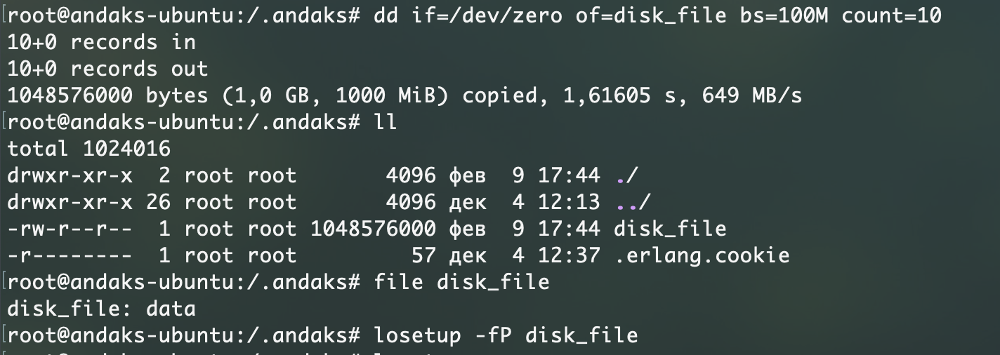
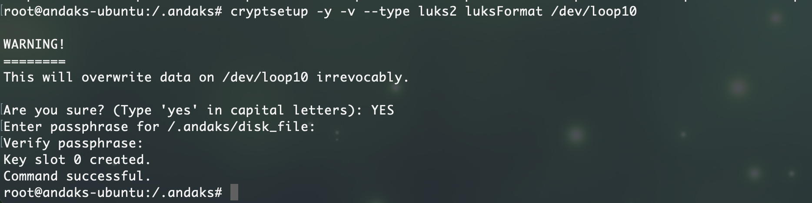
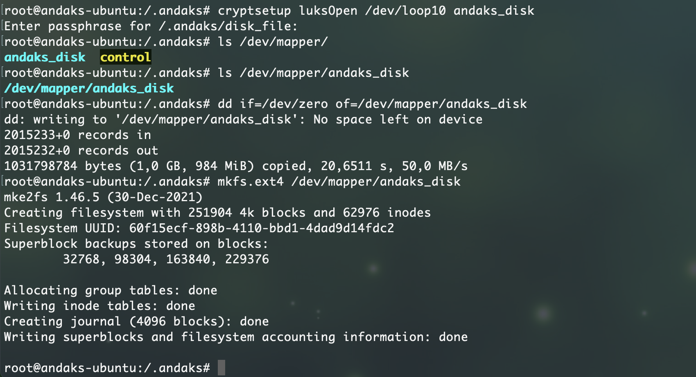
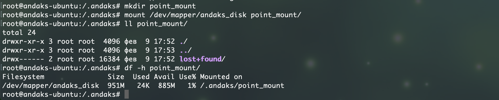

# Домашнее задание к занятию  «Защита хоста»

------

### Задание 1

1. Установите **eCryptfs**.
2. Добавьте пользователя cryptouser.
3. Зашифруйте домашний каталог пользователя с помощью eCryptfs.

*В качестве ответа  пришлите снимки экрана домашнего каталога пользователя с исходными и зашифрованными данными.*  

#### Ответ на задание 1.
1. Создание пользователя:

2. Просмотр домашней директории пользователя:

3. Просмотр домашней директории созданным пользователем:

---

### Задание 2

1. Установите поддержку **LUKS**.
2. Создайте небольшой раздел, например, 100 Мб.
3. Зашифруйте созданный раздел с помощью LUKS.

*В качестве ответа пришлите снимки экрана с поэтапным выполнением задания.*

#### Ответ на задание 2.
1. Создаем диск из обычного файла и делаем его блочным устройством:

2. Шифруем созданный диск и задаем парольную фразу:

3. Маппим диск для работы с файловой системой, создаем на нем файловую систему:

4. Монтируем диск и проверяем доступность:

---

## Дополнительные задания (со звёздочкой*)

Эти задания дополнительные, то есть не обязательные к выполнению, и никак не повлияют на получение вами зачёта по этому домашнему заданию. Вы можете их выполнить, если хотите глубже шире разобраться в материале

### Задание 3 *

1. Установите **apparmor**.
2. Повторите эксперимент, указанный в лекции.
3. Отключите (удалите) apparmor.

*В качестве ответа пришлите снимки экрана с поэтапным выполнением задания.*

